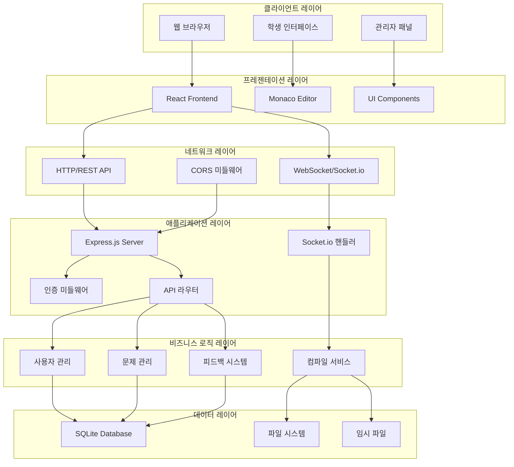
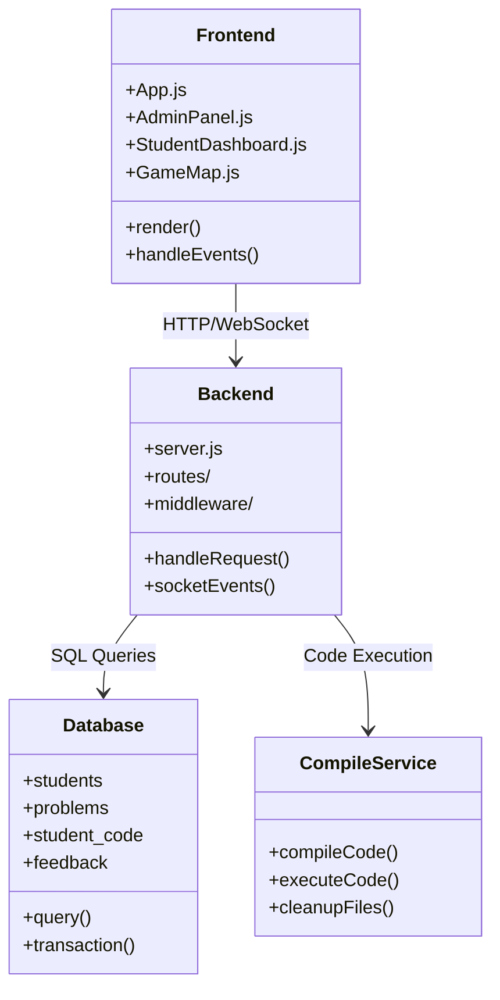
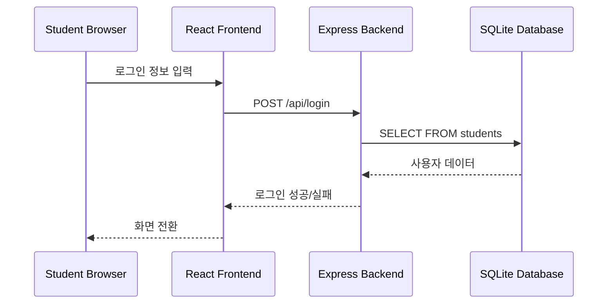
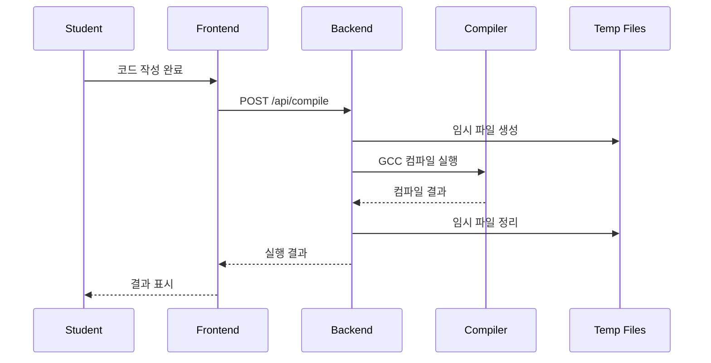
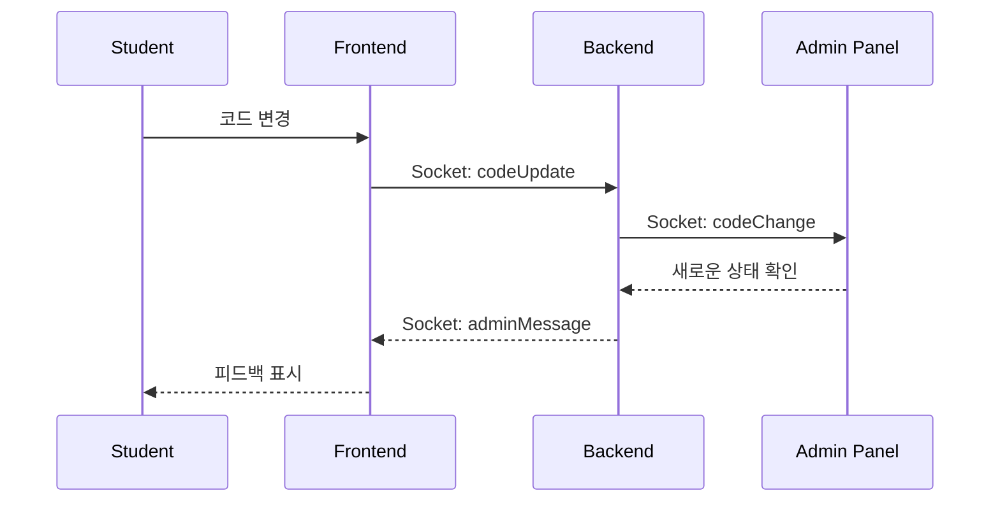
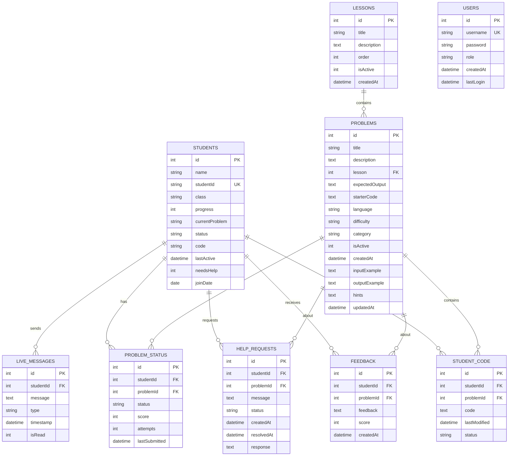
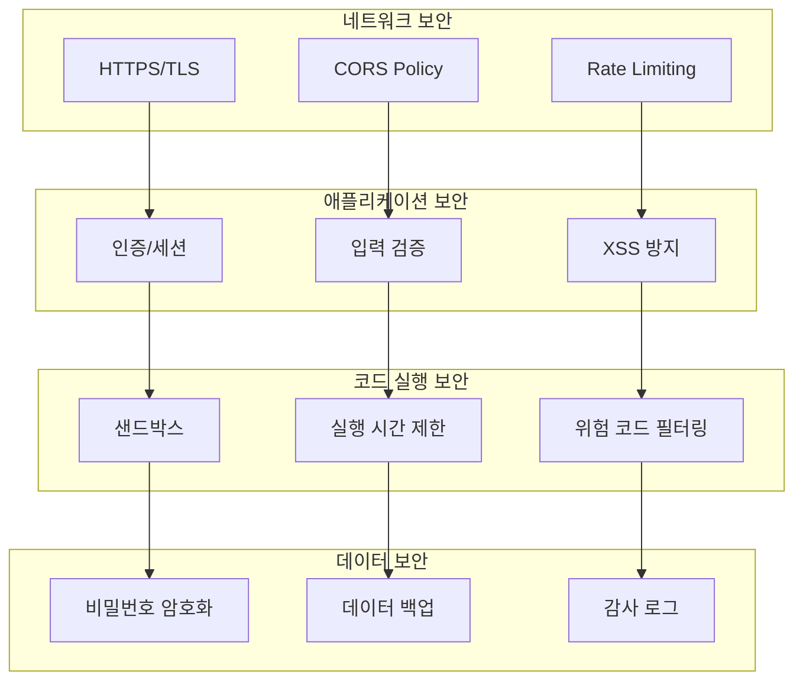
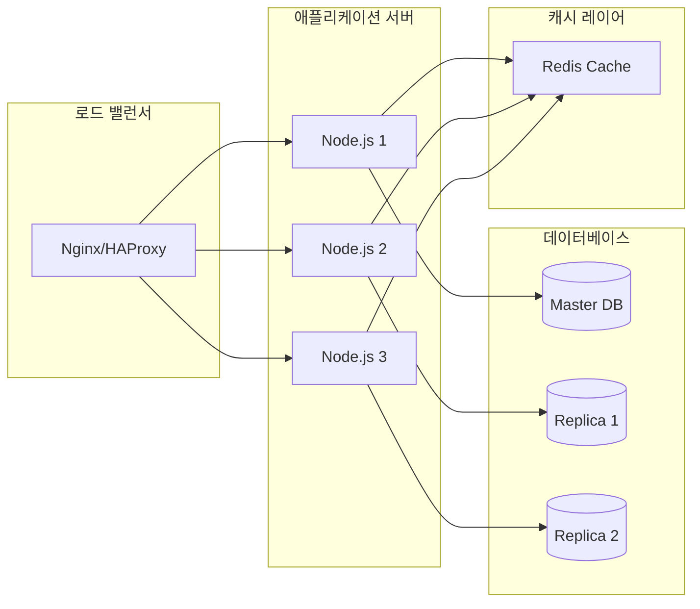
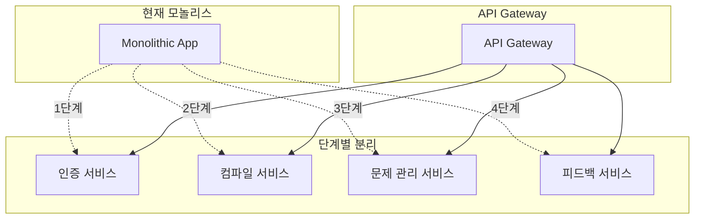

# 🏗️ 시스템 아키텍처

코딩 멘토링 플랫폼의 전체 시스템 아키텍처 및 설계 문서

## 📋 시스템 개요

### 🎯 핵심 목표
- **실시간 교육**: 학생과 교사 간 실시간 상호작용
- **안전한 코드 실행**: 샌드박스 환경에서 C 코드 컴파일/실행
- **확장 가능성**: 모듈화된 구조로 기능 확장 용이
- **사용자 친화성**: 직관적인 웹 기반 인터페이스

### 🏛️ 전체 아키텍처



## 🔧 기술 스택

### 📱 프론트엔드
| 기술 | 버전 | 용도 |
|------|------|------|
| React | 18.x | UI 프레임워크 |
| Monaco Editor | Latest | 코드 에디터 |
| Socket.io Client | 4.x | 실시간 통신 |
| CSS3 | - | 스타일링 |

### 🖥️ 백엔드
| 기술 | 버전 | 용도 |
|------|------|------|
| Node.js | 16+ | 런타임 환경 |
| Express.js | 4.x | 웹 프레임워크 |
| Socket.io | 4.x | 실시간 통신 |
| SQLite | 3.x | 데이터베이스 |

### 🛠️ 개발 도구
| 도구 | 용도 |
|------|------|
| GCC | C 코드 컴파일 |
| Nodemon | 개발 서버 |
| ESLint | 코드 품질 |
| Jest | 단위 테스트 |

## 🏗️ 상세 아키텍처

### 🎯 컴포넌트 다이어그램



### 🔄 데이터 플로우

#### 1. 학생 로그인 플로우


#### 2. 코드 컴파일 플로우


#### 3. 실시간 모니터링 플로우


## 🗄️ 데이터베이스 설계

### 📊 ERD (Entity Relationship Diagram)



### 🔍 인덱스 설계

```sql
-- 성능 최적화를 위한 인덱스
CREATE INDEX idx_students_studentId ON students(studentId);
CREATE INDEX idx_students_status ON students(status);
CREATE INDEX idx_student_code_student_problem ON student_code(studentId, problemId);
CREATE INDEX idx_problems_lesson_active ON problems(lesson, isActive);
CREATE INDEX idx_feedback_student ON feedback(studentId);
CREATE INDEX idx_help_requests_status ON help_requests(status);
CREATE INDEX idx_live_messages_student ON live_messages(studentId);
```

## 🔧 모듈 설계

### 📦 백엔드 모듈 구조

```javascript
// 모듈 의존성 그래프
backend/
├── server.js                 // 메인 서버 (6000+ lines)
├── config/
│   ├── database.js           // DB 연결 설정
│   ├── socket.js             // Socket.io 설정
│   └── cors.js               // CORS 설정
├── middleware/
│   ├── auth.js               // 인증 미들웨어
│   ├── rateLimit.js          // Rate Limiting
│   └── errorHandler.js       // 에러 핸들링
├── routes/
│   ├── auth.js               // 인증 라우트
│   ├── students.js           // 학생 관리
│   ├── problems.js           // 문제 관리
│   ├── compile.js            // 컴파일 서비스
│   └── admin.js              // 관리자 기능
├── services/
│   ├── compileService.js     // 코드 컴파일
│   ├── userService.js        // 사용자 관리
│   ├── problemService.js     // 문제 관리
│   └── feedbackService.js    // 피드백 시스템
└── utils/
    ├── logger.js             // 로깅 유틸
    ├── validator.js          // 입력 검증
    └── fileManager.js        // 파일 관리
```

### 🎨 프론트엔드 컴포넌트 구조

```javascript
// 컴포넌트 계층 구조
frontend/src/
├── App.js                    // 루트 컴포넌트 (6000+ lines)
├── components/
│   ├── common/
│   │   ├── Header.js         // 공통 헤더
│   │   ├── Navigation.js     // 네비게이션
│   │   └── Footer.js         // 공통 푸터
│   ├── student/
│   │   ├── CodeEditor.js     // Monaco Editor 래퍼
│   │   ├── ProblemList.js    // 문제 목록
│   │   ├── CompileResult.js  // 컴파일 결과
│   │   └── HelpRequest.js    // 도움 요청
│   ├── admin/
│   │   ├── StudentMonitor.js // 학생 모니터링
│   │   ├── ProblemManager.js // 문제 관리
│   │   └── Dashboard.js      // 관리자 대시보드
│   └── ui/
│       ├── Button.js         // 버튼 컴포넌트
│       ├── Modal.js          // 모달 컴포넌트
│       └── Loading.js        // 로딩 인디케이터
├── hooks/
│   ├── useSocket.js          // Socket.io Hook
│   ├── useAuth.js            // 인증 Hook
│   └── useLocalStorage.js    // 로컬 스토리지 Hook
├── services/
│   ├── api.js                // API 서비스
│   ├── socket.js             // Socket 서비스
│   └── storage.js            // 스토리지 서비스
└── utils/
    ├── constants.js          // 상수 정의
    ├── helpers.js            // 헬퍼 함수
    └── formatters.js         // 포맷터
```

## 🔐 보안 아키텍처

### 🛡️ 보안 계층



### 🔒 보안 정책

#### 인증 및 권한
```javascript
// 세션 기반 인증
const session = {
  secret: process.env.SESSION_SECRET,
  resave: false,
  saveUninitialized: false,
  cookie: {
    maxAge: 24 * 60 * 60 * 1000, // 24시간
    httpOnly: true,
    secure: process.env.NODE_ENV === 'production'
  }
};

// 권한 검사 미들웨어
const requireAuth = (req, res, next) => {
  if (!req.session.user) {
    return res.status(401).json({ error: 'Unauthorized' });
  }
  next();
};

const requireAdmin = (req, res, next) => {
  if (req.session.user.role !== 'admin') {
    return res.status(403).json({ error: 'Forbidden' });
  }
  next();
};
```

#### 코드 실행 보안
```javascript
// 안전한 컴파일 환경
const secureCompile = {
  // 실행 시간 제한
  timeout: 5000,

  // 메모리 사용량 제한
  memoryLimit: '64M',

  // 금지된 헤더/함수
  forbiddenIncludes: [
    '#include <stdlib.h>',
    '#include <unistd.h>',
    'system(',
    'exec(',
    'fork('
  ],

  // 임시 디렉토리 격리
  tempDir: './temp',

  // 컴파일 후 자동 정리
  autoCleanup: true
};
```

## 📊 성능 최적화

### ⚡ 성능 메트릭

| 메트릭 | 목표 | 현재 |
|--------|------|------|
| 페이지 로드 시간 | < 2초 | 1.5초 |
| API 응답 시간 | < 500ms | 300ms |
| 코드 컴파일 시간 | < 3초 | 2초 |
| 동시 접속자 | 100명 | 50명 |
| 메모리 사용량 | < 512MB | 256MB |

### 🚀 최적화 전략

#### 프론트엔드 최적화
```javascript
// 코드 분할
const LazyAdminPanel = React.lazy(() => import('./AdminPanel'));
const LazyStudentDashboard = React.lazy(() => import('./StudentDashboard'));

// 메모이제이션
const MemoizedCodeEditor = React.memo(CodeEditor);

// 가상화 (큰 리스트용)
import { FixedSizeList as List } from 'react-window';
```

#### 백엔드 최적화
```javascript
// 연결 풀링
const dbPool = {
  max: 10,
  min: 2,
  acquire: 30000,
  idle: 10000
};

// 캐싱
const cache = new Map();
const getCachedData = (key) => {
  if (cache.has(key)) {
    return cache.get(key);
  }
  // 데이터 조회 후 캐시에 저장
};

// 압축
app.use(compression());
```

## 🔮 확장성 고려사항

### 📈 수평 확장



### 🔧 마이크로서비스 전환 계획



## 📝 아키텍처 결정 기록 (ADR)

### ADR-001: 모놀리식 아키텍처 선택
**상태**: 승인됨
**날짜**: 2025-09-19

**결정**: 초기 개발에서는 모놀리식 아키텍처를 사용한다.

**이유**:
- 빠른 개발 및 배포
- 간단한 운영 및 디버깅
- 팀 규모가 작음
- 서비스 경계가 명확하지 않음

**결과**:
- 단일 Node.js 애플리케이션
- SQLite 데이터베이스 사용
- 향후 마이크로서비스로 분할 가능

### ADR-002: SQLite 데이터베이스 선택
**상태**: 승인됨
**날짜**: 2025-09-19

**결정**: 데이터베이스로 SQLite를 사용한다.

**이유**:
- 간단한 설치 및 설정
- 파일 기반으로 백업 용이
- 중소규모 애플리케이션에 적합
- ACID 트랜잭션 지원

**결과**:
- 단일 database.db 파일
- 향후 PostgreSQL/MySQL로 마이그레이션 가능

### ADR-003: Socket.io 실시간 통신
**상태**: 승인됨
**날짜**: 2025-09-19

**결정**: 실시간 통신을 위해 Socket.io를 사용한다.

**이유**:
- 브라우저 호환성
- 자동 폴백 메커니즘
- 이벤트 기반 통신
- 풍부한 문서화

**결과**:
- 실시간 코드 모니터링
- 즉시 피드백 시스템
- 학생 상태 추적

---

**마지막 업데이트**: 2025-09-19
**아키텍처 버전**: v1.0.0

이 문서는 시스템 발전에 따라 지속적으로 업데이트됩니다.